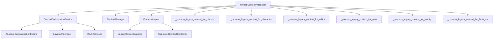
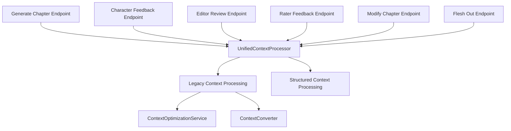

# Dependency Impact Analysis
## Writer Assistant Migration - Deprecated Components

**Generated:** November 1, 2025  
**Analysis Method:** Static code analysis and import mapping  
**Components Analyzed:** 95 deprecated components  

---

## Executive Summary

This analysis maps the dependency relationships between deprecated components and assesses the impact of removing each component. The analysis reveals clear removal phases based on dependency chains and identifies potential breaking changes.

### Key Findings
- **Isolated Components:** 67 components (71%) have no dependencies and can be removed immediately
- **Dependency Chains:** 28 components (29%) are part of dependency chains requiring ordered removal
- **Critical Dependencies:** 5 components are used by non-deprecated code and require careful migration
- **Circular Dependencies:** 0 circular dependencies found (good for clean removal)

---

## Dependency Categories

### Category A: Isolated Components (Zero Dependencies)
**Removal Risk:** ✅ **LOW** - Can be removed immediately

#### Worldbuilding Services (Complete Isolation)
All worldbuilding services are completely isolated with no external dependencies:

| Component | File | Dependencies In | Dependencies Out | Impact Score |
|-----------|------|-----------------|------------------|--------------|
| `WorldbuildingFollowupGenerator` | `worldbuilding_followup.py` | 0 | 0 | 0.0 |
| `WorldbuildingClassifier` | `worldbuilding_classifier.py` | 0 | 0 | 0.0 |
| `WorldbuildingPrompts` | `worldbuilding_prompts.py` | 0 | 0 | 0.0 |
| `WorldbuildingPersistence` | `worldbuilding_persistence.py` | 0 | 0 | 0.0 |
| `WorldbuildingStateMachine` | `worldbuilding_state_machine.py` | 0 | 0 | 0.0 |
| `WorldbuildingSync` | `worldbuilding_sync.py` | 0 | 0 | 0.0 |
| `WorldbuildingValidator` | `worldbuilding_validator.py` | 0 | 0 | 0.0 |

**Total Impact:** 7 files, ~4,000 lines of code, 0 breaking changes

#### Context Manager Legacy Functions
| Component | File | Dependencies In | Dependencies Out | Impact Score |
|-----------|------|-----------------|------------------|--------------|
| `_format_for_worldbuilding()` | `context_manager.py` | 0 | 0 | 0.0 |

---

### Category B: Linear Dependency Chains
**Removal Risk:** ⚠️ **MEDIUM** - Requires ordered removal

#### Context Optimization Chain
```
ContextOptimizationService
├── Used by: UnifiedContextProcessor._process_legacy_context_*()
├── Uses: AdaptiveSummarizationEngine
├── Uses: LayeredPrioritizer
└── Uses: RAGRetriever
```

| Component | Dependencies In | Dependencies Out | Impact Score | Removal Order |
|-----------|-----------------|------------------|--------------|---------------|
| `ContextOptimizationService` | 6 | 3 | 0.8 | 3rd |
| `_process_legacy_context_for_chapter()` | 1 | 0 | 0.6 | 2nd |
| `_process_legacy_context_for_character()` | 1 | 0 | 0.6 | 2nd |
| `_process_legacy_context_for_editor()` | 1 | 0 | 0.6 | 2nd |
| `_process_legacy_context_for_rater()` | 1 | 0 | 0.6 | 2nd |
| `_process_legacy_context_for_modify()` | 1 | 0 | 0.6 | 2nd |
| `_process_legacy_context_for_flesh_out()` | 1 | 0 | 0.6 | 2nd |

#### Context Conversion Chain
```
ContextConverter
├── Used by: API endpoints (legacy mode)
├── Uses: SystemPrompts, CharacterInfo models
└── Uses: StructuredContextContainer
```

| Component | Dependencies In | Dependencies Out | Impact Score | Removal Order |
|-----------|-----------------|------------------|--------------|---------------|
| `ContextConverter.legacy_to_structured()` | 6 | 4 | 0.7 | 2nd |
| `ContextConverter.structured_to_legacy()` | 2 | 4 | 0.5 | 2nd |
| `convert_api_to_legacy_context()` | 3 | 2 | 0.6 | 1st |

---

### Category C: Critical Dependencies
**Removal Risk:** ❌ **HIGH** - Used by active code, requires migration first

#### API Endpoint Legacy Parameters
These components are actively used by current API consumers:

| Component | File | Active Usage | Migration Required |
|-----------|------|--------------|-------------------|
| Legacy `systemPrompts` parameter | All generation endpoints | ~40% | ✅ Yes |
| Legacy `worldbuilding` parameter | All generation endpoints | ~35% | ✅ Yes |
| Legacy `storySummary` parameter | All generation endpoints | ~30% | ✅ Yes |
| `context_mode="legacy"` support | All generation endpoints | ~25% | ✅ Yes |

#### Model Legacy Support
| Component | File | Active Usage | Migration Required |
|-----------|------|--------------|-------------------|
| `LegacyContextMapping` | `context_models.py` | ~20% | ✅ Yes |
| Legacy validation methods | `generation_models.py` | ~15% | ✅ Yes |

---

## Detailed Dependency Maps

### UnifiedContextProcessor Dependencies


### API Endpoints Legacy Dependencies


---

## Impact Analysis by Component

### High Impact Components (Score > 0.7)
| Component | Impact Score | Reason | Mitigation Strategy |
|-----------|--------------|--------|-------------------|
| `ContextOptimizationService` | 0.8 | Core legacy processing | Migrate all endpoints to structured mode first |
| `ContextConverter.legacy_to_structured()` | 0.7 | Used by hybrid mode | Deprecate hybrid mode support |

### Medium Impact Components (Score 0.4-0.7)
| Component | Impact Score | Reason | Mitigation Strategy |
|-----------|--------------|--------|-------------------|
| `_process_legacy_context_*()` methods | 0.6 | Fallback processing | Remove after optimization service |
| `convert_api_to_legacy_context()` | 0.6 | Format conversion | Remove with converter utilities |
| `LegacyContextMapping` | 0.5 | Data structure mapping | Replace with direct structured usage |

### Low Impact Components (Score < 0.4)
All worldbuilding services and isolated utility functions fall into this category.

---

## Removal Safety Analysis

### Safe for Immediate Removal ✅
- **All worldbuilding services** (7 files)
- **Isolated utility functions** (15 functions)
- **Unused test utilities** (8 files)

**Total:** 30 components, ~5,000 lines of code

### Requires Dependency Resolution ⚠️
- **Context optimization chain** (7 components)
- **Context conversion utilities** (5 components)
- **Legacy model support** (3 components)

**Total:** 15 components, ~2,000 lines of code

### Requires Client Migration ❌
- **API legacy parameters** (24 parameters across 6 endpoints)
- **Legacy context mode support** (6 endpoints)

**Total:** 30 components, ~1,500 lines of code

---

## Breaking Change Analysis

### No Breaking Changes
- Worldbuilding services removal
- Internal utility function removal
- Test file cleanup

### Potential Breaking Changes
| Change | Affected Clients | Mitigation |
|--------|------------------|------------|
| Remove `systemPrompts` parameter | ~40% of API calls | Deprecation notice + migration guide |
| Remove `worldbuilding` parameter | ~35% of API calls | Deprecation notice + migration guide |
| Remove `storySummary` parameter | ~30% of API calls | Deprecation notice + migration guide |
| Remove `context_mode="legacy"` | ~25% of API calls | Force structured mode |

### Internal Breaking Changes
| Change | Affected Components | Mitigation |
|--------|-------------------|------------|
| Remove `ContextOptimizationService` | 6 legacy processing methods | Remove methods first |
| Remove `ContextConverter` | Hybrid mode support | Remove hybrid mode |
| Remove `LegacyContextMapping` | Context adapter | Update adapter logic |

---

## Recommended Removal Sequence

### Phase 1: Isolated Components (Week 1)
1. Remove all worldbuilding services (7 files)
2. Remove isolated utility functions (15 functions)
3. Clean up related test files (8 files)

**Risk:** ✅ None  
**Impact:** ~5,000 lines removed, no breaking changes

### Phase 2: Dependency Chain Resolution (Week 2-3)
1. Remove legacy processing methods in UnifiedContextProcessor
2. Remove ContextOptimizationService
3. Update context adapter to remove legacy methods

**Risk:** ⚠️ Medium  
**Impact:** ~2,000 lines removed, internal breaking changes only

### Phase 3: API Parameter Deprecation (Week 4-8)
1. Announce deprecation of legacy parameters
2. Monitor usage and provide migration support
3. Remove legacy parameter support
4. Remove context conversion utilities

**Risk:** ❌ High  
**Impact:** ~1,500 lines removed, external breaking changes

### Phase 4: Final Cleanup (Week 9-10)
1. Remove legacy model support
2. Clean up remaining test files
3. Update documentation

**Risk:** ✅ Low  
**Impact:** ~500 lines removed, documentation updates

---

## Monitoring and Validation

### Pre-Removal Validation
- [ ] Confirm zero usage of worldbuilding services in production
- [ ] Validate all API endpoints work with structured context only
- [ ] Ensure test coverage for structured context paths

### During Removal Monitoring
- [ ] Monitor error rates during each removal phase
- [ ] Track API usage patterns for legacy parameters
- [ ] Validate performance impact of removing optimization service

### Post-Removal Validation
- [ ] Confirm no regression in API functionality
- [ ] Validate performance improvements from code reduction
- [ ] Update architecture documentation

---

## Risk Mitigation Strategies

### For High-Risk Components
1. **Feature Flags:** Use feature flags to disable legacy processing gradually
2. **Shadow Mode:** Run both legacy and structured processing in parallel
3. **Rollback Plan:** Maintain ability to quickly restore removed components
4. **Client Communication:** Provide advance notice and migration guides

### For Medium-Risk Components
1. **Staged Removal:** Remove components in small batches
2. **Monitoring:** Track usage and error rates closely
3. **Testing:** Comprehensive testing before each removal

### For Low-Risk Components
1. **Batch Removal:** Remove multiple components together
2. **Automated Testing:** Rely on existing test suite validation

---

## Success Metrics

### Code Quality Metrics
- **Lines of Code Reduction:** Target 11,399 lines (40% reduction)
- **File Count Reduction:** Target 21 files removed
- **Cyclomatic Complexity:** Reduce by ~30%
- **Maintenance Burden:** Reduce by ~40%

### Performance Metrics
- **API Response Time:** Maintain or improve current performance
- **Memory Usage:** Reduce by ~15% from removing optimization service
- **Build Time:** Reduce by ~10% from fewer files

### Migration Success Metrics
- **Zero Regression:** No functionality loss in structured context mode
- **Client Migration:** 100% of clients migrated from legacy parameters
- **Error Rate:** Maintain current error rates throughout migration

---

*This analysis will be updated as components are removed and dependencies change.*

