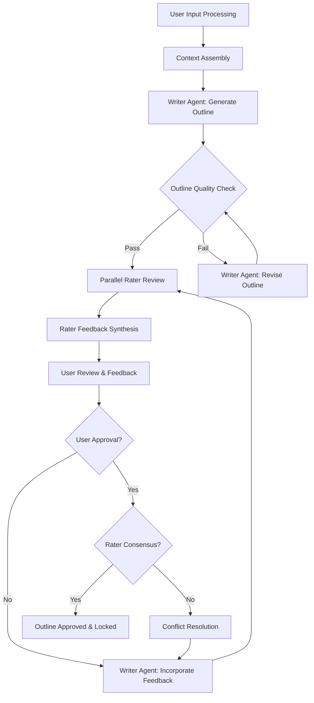
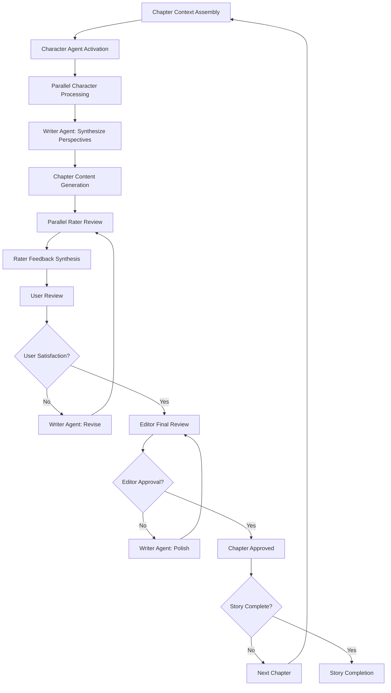

# LangGraph Workflow Requirements

## Overview

The Writer Assistant uses LangGraph to orchestrate complex multi-agent workflows that coordinate story development through two distinct phases: outline development and chapter creation. The workflow system manages agent interactions, memory synchronization, and feedback integration.

## Workflow Architecture

### Core Workflow Principles

1. **Phase-Based Development**: Clear separation between outline and chapter development phases
2. **Multi-Agent Coordination**: Parallel and sequential agent execution as appropriate
3. **Dynamic Routing**: Workflow paths determined by story needs and agent feedback
4. **State Persistence**: Maintain workflow state across user sessions
5. **Error Recovery**: Graceful handling of agent failures and system interruptions

### LangGraph State Schema

#### Global Workflow State
```json
{
  "story_context": {
    "story_id": "uuid_123",
    "title": "Story Title",
    "genre": "mystery",
    "user_id": "user_456",
    "creation_date": "2025-09-24",
    "current_phase": "outline_development", // or "chapter_development"
    "development_stage": "initial_creation" // "revision", "approved", etc.
  },
  "phase_state": {
    "outline_phase": {
      "status": "in_progress", // "pending", "completed", "approved"
      "iteration_count": 2,
      "user_feedback_received": true,
      "rater_feedback_pending": ["flow_rater", "genre_rater"],
      "approval_status": {
        "user_approved": false,
        "rater_consensus": false,
        "blocking_issues": ["pacing_concerns", "character_arc_issues"]
      }
    },
    "chapter_phase": {
      "current_chapter": 3,
      "status": "awaiting_rater_feedback",
      "iteration_count": 1,
      "review_cycle": {
        "rater_feedback_received": ["consistency_rater"],
        "rater_feedback_pending": ["flow_rater", "quality_rater"],
        "user_review_status": "not_started",
        "editor_review_status": "pending"
      }
    }
  },
  "agent_states": {
    "writer_agent": {
      "current_task": "chapter_generation",
      "status": "active",
      "context_loaded": true,
      "memory_sync_status": "current"
    },
    "character_agents": {
      "john_character": {
        "active_in_scene": true,
        "memory_updated": "2025-09-24T10:30:00",
        "perspective_ready": true
      }
    },
    "rater_agents": {
      "consistency_rater": {
        "review_status": "completed",
        "feedback_submitted": true,
        "rating_score": 7.5
      }
    }
  },
  "workflow_history": {
    "completed_steps": [
      {
        "step": "user_input_processing",
        "timestamp": "2025-09-24T09:00:00",
        "duration": 1.2,
        "success": true
      }
    ],
    "current_step": "rater_feedback_collection",
    "pending_steps": ["editor_review", "user_presentation"],
    "error_history": []
  },
  "memory_sync_status": {
    "last_global_sync": "2025-09-24T10:25:00",
    "pending_updates": [],
    "sync_conflicts": [],
    "next_sync_required": false
  }
}
```

## Phase 1: Outline Development Workflow

### Outline Creation Flow



### Outline Workflow State Management

**State Transitions**:
```python
# Conceptual state transitions
outline_states = {
    "initial_creation": {
        "entry_conditions": ["user_input_received"],
        "active_agents": ["writer_agent"],
        "next_states": ["rater_review", "revision_needed"]
    },
    "rater_review": {
        "entry_conditions": ["outline_generated"],
        "active_agents": ["all_rater_agents"],
        "parallel_execution": True,
        "next_states": ["user_review", "revision_needed"]
    },
    "user_review": {
        "entry_conditions": ["rater_feedback_complete"],
        "wait_for": "user_feedback",
        "timeout": "24_hours",
        "next_states": ["approved", "revision_needed"]
    },
    "revision_needed": {
        "entry_conditions": ["feedback_received"],
        "active_agents": ["writer_agent"],
        "next_states": ["rater_review", "user_review"]
    },
    "approved": {
        "entry_conditions": ["user_approval", "rater_consensus"],
        "actions": ["lock_outline", "initialize_chapter_phase"],
        "final_state": True
    }
}
```

## Phase 2: Chapter Development Workflow

### Chapter Creation Flow



### Chapter Workflow Coordination

**Agent Orchestration**:
- **Scene-Based Activation**: Only activate character agents present in current scene
- **Parallel Character Processing**: Characters process scene simultaneously without cross-contamination
- **Sequential Review Stages**: Raters → User → Editor in defined sequence
- **Memory Update Cascades**: Automatic memory synchronization after each major step

**Dynamic Routing Logic**:
```json
{
  "routing_conditions": {
    "character_activation": {
      "condition": "character_present_in_scene",
      "agents": ["relevant_character_agents"],
      "execution": "parallel"
    },
    "rater_selection": {
      "condition": "story_genre_and_phase",
      "agents": ["genre_specific_raters", "always_active_raters"],
      "execution": "parallel"
    },
    "revision_routing": {
      "condition": "feedback_severity_level",
      "high_severity": ["writer_agent", "relevant_raters", "editor_agent"],
      "low_severity": ["writer_agent"],
      "execution": "sequential"
    }
  }
}
```

## Workflow Execution Patterns

### Parallel Processing

**Simultaneous Agent Execution**:
- Character agents process scenes independently
- Rater agents evaluate content from different perspectives
- Memory updates happen without blocking other agents
- Error in one agent doesn't block others

**Coordination Requirements**:
- Shared context access without modification conflicts
- Result aggregation and synthesis
- Timeout handling for slow agents
- Partial success handling

### Sequential Processing

**Ordered Execution Chains**:
- Writer synthesis after character processing
- User review after rater feedback
- Editor review after user approval
- Memory synchronization after major updates

**Dependency Management**:
- Clear input/output specifications for each step
- State validation before step execution
- Rollback capability for failed steps
- Progress tracking and resumption

### Conditional Workflows

**Dynamic Path Selection**:
```json
{
  "conditional_flows": {
    "revision_complexity": {
      "simple_revision": {
        "path": ["writer_agent", "user_review"],
        "condition": "minor_feedback_only"
      },
      "complex_revision": {
        "path": ["writer_agent", "rater_review", "user_review", "editor_review"],
        "condition": "major_structural_changes"
      }
    },
    "story_genre_adaptation": {
      "mystery_story": {
        "additional_agents": ["mystery_genre_rater", "clue_consistency_checker"],
        "special_steps": ["red_herring_validation", "solution_fairness_check"]
      },
      "romance_story": {
        "additional_agents": ["romance_genre_rater", "relationship_dynamics_checker"],
        "special_steps": ["chemistry_validation", "emotional_satisfaction_check"]
      }
    }
  }
}
```

## Error Handling and Recovery

### Failure Modes

**Agent Failure Recovery**:
- **Individual Agent Timeout**: Continue workflow with available agents
- **Critical Agent Failure**: Pause workflow and notify user
- **Memory Corruption**: Restore from last known good state
- **Context Overflow**: Implement emergency context compression

**Workflow Interruption Handling**:
- **User Session Timeout**: Save workflow state for resumption
- **System Restart**: Restore workflow from persistent state
- **Resource Exhaustion**: Graceful degradation with user notification
- **Configuration Errors**: Fallback to default configurations

### Recovery Procedures

**State Recovery Protocol**:
```json
{
  "recovery_procedures": {
    "agent_failure": {
      "detection": "timeout_or_error_response",
      "immediate_action": "isolate_failed_agent",
      "recovery_steps": [
        "restart_agent_with_clean_state",
        "restore_memory_from_backup",
        "resume_workflow_from_last_checkpoint"
      ],
      "fallback": "continue_without_failed_agent_if_non_critical"
    },
    "workflow_corruption": {
      "detection": "state_validation_failure",
      "immediate_action": "pause_all_agents",
      "recovery_steps": [
        "restore_from_last_checkpoint",
        "validate_memory_consistency",
        "resume_with_user_confirmation"
      ],
      "user_notification": "explain_recovery_process_and_potential_loss"
    }
  }
}
```

## Performance and Optimization

### Workflow Efficiency

**Optimization Strategies**:
- **Batched Operations**: Group similar operations for efficiency
- **Predictive Loading**: Prepare next workflow steps in advance
- **Resource Pooling**: Share computational resources across agents
- **Caching**: Cache frequently used workflow patterns

**Performance Monitoring**:
- **Step Duration Tracking**: Monitor time for each workflow step
- **Agent Response Times**: Track individual agent performance
- **Memory Usage**: Monitor memory consumption during workflow execution
- **User Wait Times**: Track total time from user input to output

### Scalability Considerations

**Concurrent User Support**:
- **Workflow Isolation**: Separate workflow instances for different users
- **Resource Allocation**: Fair resource distribution across active workflows
- **Priority Queuing**: Prioritize workflows based on user tier or urgency
- **Load Balancing**: Distribute agent processing across available resources

## Integration Requirements

### LangChain Integration

**Chain Composition**:
- **Agent Chains**: Individual chains for each agent type
- **Workflow Chains**: Meta-chains that orchestrate agent interactions
- **Memory Chains**: Chains specifically for memory management operations
- **Feedback Chains**: Chains for processing and integrating feedback

**Custom Tools Integration**:
- **Story Analysis Tools**: Custom tools for narrative analysis
- **Memory Management Tools**: Tools for memory operations and synchronization
- **Quality Assessment Tools**: Automated quality checking tools
- **Export/Import Tools**: Tools for story and workflow state persistence

### External System Integration

**User Interface Integration**:
- **Real-time Updates**: WebSocket connections for workflow progress updates
- **Interactive Checkpoints**: User decision points during workflow execution
- **Progress Visualization**: Visual representation of workflow progress
- **Error Reporting**: User-friendly error messages and recovery options

**Storage System Integration**:
- **Workflow State Persistence**: Regular saving of workflow state
- **Memory Synchronization**: Coordination with memory storage systems
- **Configuration Management**: Dynamic configuration loading during workflow
- **Audit Trail**: Complete logging of workflow decisions and actions

This workflow system ensures smooth coordination between all agents while maintaining flexibility for different story types and user preferences, with robust error handling and recovery capabilities.
    