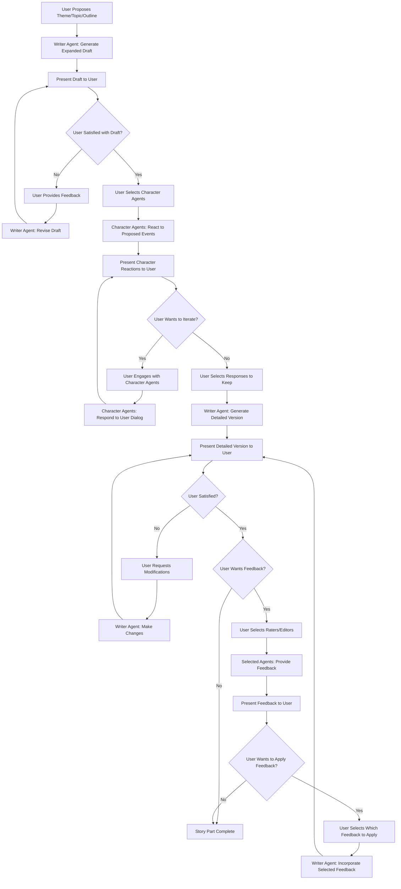
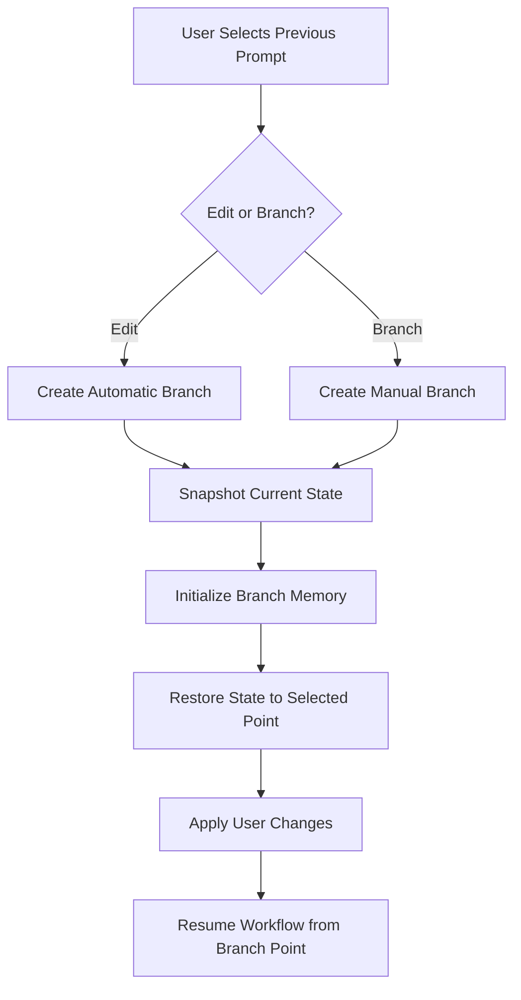
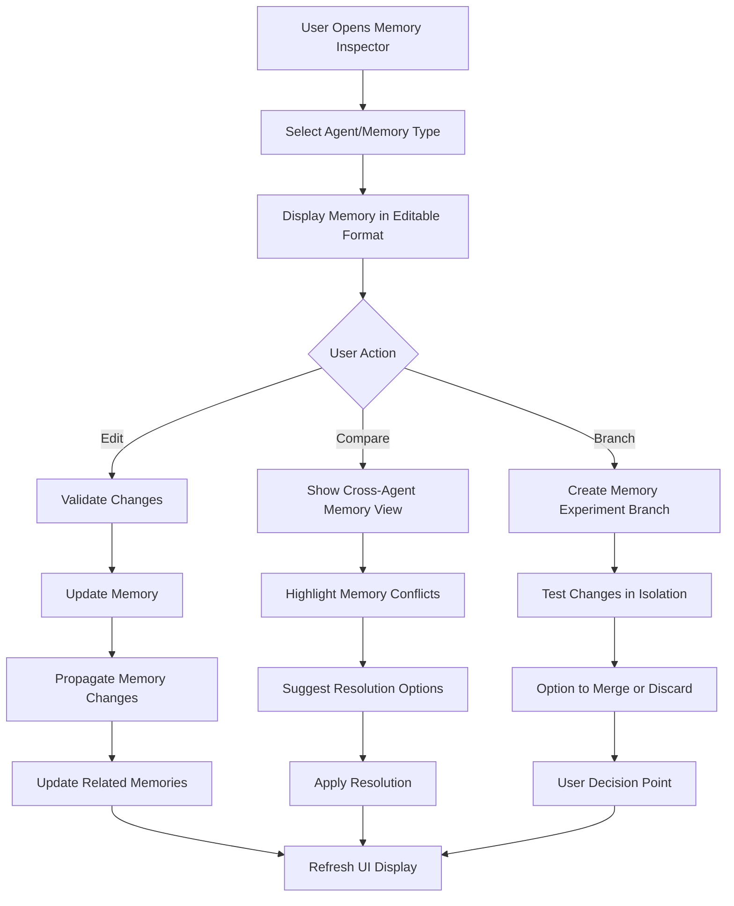
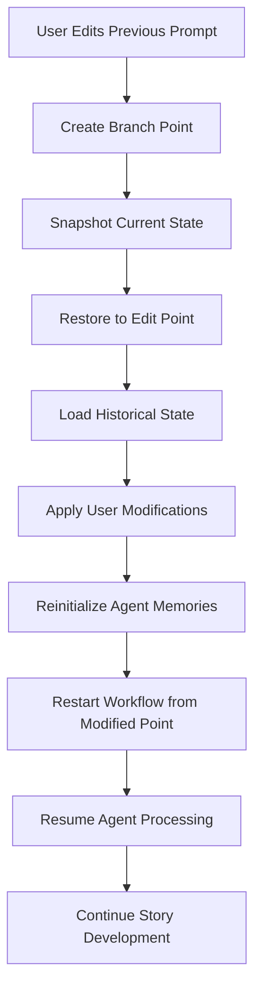
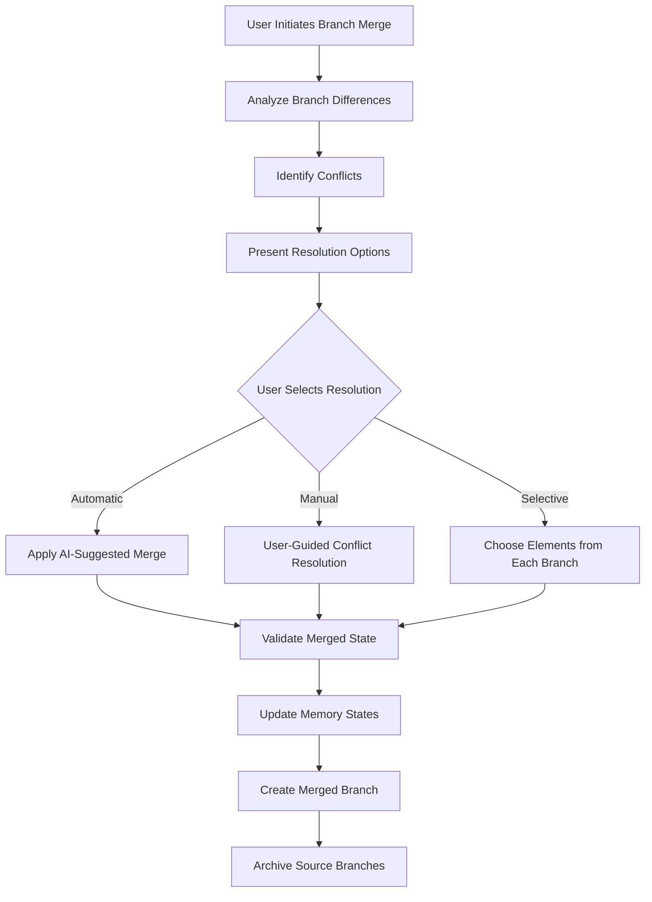

# LangGraph Workflow Requirements

## Overview

The Writer Assistant uses client-side workflow management to coordinate story development through a user-driven, iterative process with stateless backend services. All workflow state, story data, and user decisions are managed entirely on the client-side, while the backend provides independent AI agent services without maintaining any session state or user data.

## Workflow Architecture

### Core Workflow Principles

1. **User-Driven Control**: Users initiate and approve every major step in the story development process
2. **Iterative Refinement**: Continuous user-agent collaboration through multiple revision cycles
3. **Agent Selection Freedom**: Users choose which character agents and feedback sources to engage
4. **Flexible Story Progression**: Support for any story part - themes, topics, outlines, or detailed scenes
5. **Client-Side Orchestration**: All workflow coordination managed by client application
6. **Stateless Service Integration**: Backend services provide responses without maintaining workflow state
7. **Client-Side State Persistence**: Complete workflow state maintained in browser local storage
8. **Client-Side Error Recovery**: Error handling and recovery managed entirely by frontend
9. **Client-Side Conversation Branching**: All branching logic and state managed in browser storage
10. **Client-Side Memory Management**: Complete user access to examine and modify all memories locally
11. **Client-Side Branch Isolation**: Independent workflow and memory states managed by client

### Client-Side Workflow State Schema

#### Browser Local Storage State Structure
```json
{
  "client_workflow_state": {
    "story_context": {
      "story_id": "uuid_123",
      "title": "Story Title",
      "genre": "mystery",
      "creation_date": "2025-09-24",
      "current_phase": "outline_development",
      "development_stage": "initial_creation",
      "last_modified": "2025-09-24T10:30:00Z"
    },
  "conversation_tree": {
    "current_branch_id": "main_branch",
    "branch_metadata": {
      "main_branch": {
        "created_at": "2025-09-24T09:00:00Z",
        "branched_from": null,
        "description": "Main story development path"
      },
      "alt_branch_001": {
        "created_at": "2025-09-24T14:30:00Z",
        "branched_from": "prompt_005",
        "description": "Alternative character development"
      }
    },
    "prompt_history": {
      "main_branch": [
        {
          "prompt_id": "prompt_001",
          "timestamp": "2025-09-24T09:00:00Z",
          "user_input": "Create a mystery story about a detective",
          "state_snapshot": {...},
          "editable": true
        }
      ]
    }
  },
  "phase_state": {
    "outline_phase": {
      "status": "in_progress", // "pending", "completed", "approved"
      "iteration_count": 2,
      "user_feedback_received": true,
      "rater_feedback_pending": ["flow_rater", "genre_rater"],
      "approval_status": {
        "user_approved": false,
        "rater_consensus": false,
        "blocking_issues": ["pacing_concerns", "character_arc_issues"]
      }
    },
    "chapter_phase": {
      "current_chapter": 3,
      "status": "awaiting_rater_feedback",
      "iteration_count": 1,
      "review_cycle": {
        "rater_feedback_received": ["consistency_rater"],
        "rater_feedback_pending": ["flow_rater", "quality_rater"],
        "user_review_status": "not_started",
        "editor_review_status": "pending"
      }
    }
  },
  "agent_states": {
    "writer_agent": {
      "current_task": "chapter_generation",
      "status": "active",
      "context_loaded": true,
      "memory_sync_status": "current"
    },
    "character_agents": {
      "john_character": {
        "active_in_scene": true,
        "memory_updated": "2025-09-24T10:30:00",
        "perspective_ready": true
      }
    },
    "rater_agents": {
      "consistency_rater": {
        "review_status": "completed",
        "feedback_submitted": true,
        "rating_score": 7.5
      }
    }
  },
  "workflow_history": {
    "completed_steps": [
      {
        "step": "user_input_processing",
        "timestamp": "2025-09-24T09:00:00",
        "duration": 1.2,
        "success": true
      }
    ],
    "current_step": "rater_feedback_collection",
    "pending_steps": ["editor_review", "user_presentation"],
    "error_history": []
  },
  "memory_sync_status": {
    "last_global_sync": "2025-09-24T10:25:00",
    "pending_updates": [],
    "sync_conflicts": [],
    "next_sync_required": false
  }
}
```

## User-Driven Story Development Workflow

### Story Part Development Flow



### User-Driven Workflow State Management

**State Transitions**:
```python
# Conceptual state transitions
story_development_states = {
    "user_input": {
        "entry_conditions": ["user_provides_theme_topic_or_outline"],
        "active_agents": [],
        "next_states": ["draft_generation"]
    },
    "draft_generation": {
        "entry_conditions": ["user_input_received"],
        "active_agents": ["writer_agent"],
        "next_states": ["draft_review", "draft_revision"]
    },
    "draft_review": {
        "entry_conditions": ["draft_generated"],
        "wait_for": "user_approval_or_feedback",
        "next_states": ["draft_revision", "character_selection", "detailed_generation"]
    },
    "draft_revision": {
        "entry_conditions": ["user_feedback_received"],
        "active_agents": ["writer_agent"],
        "next_states": ["draft_review"]
    },
    "character_selection": {
        "entry_conditions": ["user_approves_draft"],
        "wait_for": "user_selects_character_agents",
        "next_states": ["character_reaction"]
    },
    "character_reaction": {
        "entry_conditions": ["character_agents_selected"],
        "active_agents": ["selected_character_agents"],
        "parallel_execution": True,
        "next_states": ["character_dialog", "response_selection"]
    },
    "character_dialog": {
        "entry_conditions": ["user_wants_to_iterate"],
        "active_agents": ["selected_character_agents"],
        "wait_for": "user_dialog_input",
        "next_states": ["character_reaction", "response_selection"]
    },
    "response_selection": {
        "entry_conditions": ["user_satisfied_with_character_responses"],
        "wait_for": "user_selects_responses_to_keep",
        "next_states": ["detailed_generation"]
    },
    "detailed_generation": {
        "entry_conditions": ["responses_selected_or_draft_approved"],
        "active_agents": ["writer_agent"],
        "next_states": ["detailed_review"]
    },
    "detailed_review": {
        "entry_conditions": ["detailed_version_generated"],
        "wait_for": "user_review",
        "next_states": ["detailed_modification", "feedback_selection", "completion"]
    },
    "detailed_modification": {
        "entry_conditions": ["user_requests_changes"],
        "active_agents": ["writer_agent"],
        "wait_for": "user_modification_requests",
        "next_states": ["detailed_review"]
    },
    "feedback_selection": {
        "entry_conditions": ["user_wants_feedback"],
        "wait_for": "user_selects_raters_editors",
        "next_states": ["feedback_generation"]
    },
    "feedback_generation": {
        "entry_conditions": ["feedback_agents_selected"],
        "active_agents": ["selected_rater_editor_agents"],
        "parallel_execution": True,
        "next_states": ["feedback_review"]
    },
    "feedback_review": {
        "entry_conditions": ["feedback_received"],
        "wait_for": "user_decides_on_feedback",
        "next_states": ["feedback_application", "completion"]
    },
    "feedback_application": {
        "entry_conditions": ["user_selects_feedback_to_apply"],
        "active_agents": ["writer_agent"],
        "next_states": ["detailed_review"]
    },
    "completion": {
        "entry_conditions": ["user_satisfied_no_feedback_wanted"],
        "actions": ["save_story_part", "prepare_for_next_part"],
        "final_state": True
    }
}
```

## User Control Points and Decision Gates

### User Decision Framework

The workflow places the user at the center of every major decision, providing multiple control points throughout the story development process:

**Primary User Control Points**:
1. **Initial Input**: User provides theme, topic, or basic outline
2. **Draft Approval**: User reviews and approves/modifies writer's expanded draft
3. **Character Selection**: User chooses which character agents to engage
4. **Dialog Management**: User controls conversation flow with character agents
5. **Response Curation**: User selects which character responses to incorporate
6. **Content Review**: User reviews detailed generated content
7. **Modification Requests**: User specifies exact changes needed
8. **Feedback Selection**: User chooses which raters/editors to consult
9. **Feedback Application**: User decides which feedback to implement

**User Decision Gates**:
```json
{
  "decision_gates": {
    "draft_approval_gate": {
      "prompt": "Review the expanded draft outline",
      "options": ["approve", "request_changes", "iterate_further"],
      "required": true,
      "blocking": true
    },
    "character_engagement_gate": {
      "prompt": "Select character agents to react to the proposed events",
      "options": ["select_characters", "skip_character_input", "proceed_to_detailed_generation"],
      "required": false,
      "blocking": false
    },
    "character_dialog_gate": {
      "prompt": "Continue dialog with character agents?",
      "options": ["continue_dialog", "select_responses", "add_more_characters"],
      "required": false,
      "blocking": false
    },
    "detailed_content_gate": {
      "prompt": "Review the detailed generated content",
      "options": ["approve", "request_modifications", "regenerate"],
      "required": true,
      "blocking": true
    },
    "feedback_consultation_gate": {
      "prompt": "Consult raters and editors for feedback?",
      "options": ["select_feedback_agents", "skip_feedback", "complete_story_part"],
      "required": false,
      "blocking": false
    },
    "feedback_application_gate": {
      "prompt": "Apply feedback to the content?",
      "options": ["select_feedback_to_apply", "ignore_feedback", "request_clarification"],
      "required": false,
      "blocking": false
    }
  }
}
```

### User-Driven Agent Coordination

**User-Controlled Agent Orchestration**:
- **User-Selected Activation**: Only activate agents chosen by the user
- **Parallel Character Processing**: Selected characters process content simultaneously
- **User-Directed Review Stages**: User chooses which raters/editors to engage and in what order
- **User-Controlled Memory Updates**: Memory synchronization triggered by user decisions
- **Flexible Agent Engagement**: Users can add or remove agents at any workflow stage

**Dynamic Routing Based on User Choices**:
```json
{
  "user_driven_routing": {
    "character_agent_selection": {
      "trigger": "user_selects_character_agents",
      "agents": ["user_selected_characters"],
      "execution": "parallel",
      "user_options": ["add_more_agents", "remove_agents", "change_agent_focus"]
    },
    "feedback_agent_selection": {
      "trigger": "user_requests_feedback",
      "agents": ["user_selected_raters_and_editors"],
      "execution": "parallel",
      "user_options": ["selective_feedback", "comprehensive_review", "focused_critique"]
    },
    "revision_approach": {
      "trigger": "user_requests_changes",
      "routing_options": {
        "direct_writer_revision": ["writer_agent"],
        "character_informed_revision": ["writer_agent", "selected_character_agents"],
        "feedback_guided_revision": ["writer_agent", "selected_feedback_agents"]
      },
      "user_choice": "required"
    },
    "iterative_refinement": {
      "trigger": "user_wants_to_continue_iterating",
      "available_agents": ["all_agent_types"],
      "user_control": "select_any_combination_for_next_iteration"
    }
  }
}
```

## Workflow Execution Patterns

### Client-Side Parallel Processing

**Client-Orchestrated Simultaneous Agent Requests**:
- Client sends parallel requests to multiple stateless agent endpoints
- Character agents and rater agents process requests independently without server coordination
- Client manages response collection and user presentation
- Failed requests handled by client retry logic without affecting other operations

**Client-Centered Coordination**:
- Client provides all context needed for each agent request
- Client presents results to user for selection and curation
- Client manages request timeouts and retry logic
- Client handles partial results and failed requests independently

### Client-Managed Sequential Processing

**Client-Orchestrated Execution Chains**:
- Client sends requests to stateless agent endpoints in user-defined sequence
- Client presents all agent outputs to user before proceeding
- Client manages workflow progression based on user decisions
- Client updates local state when user approves changes

**Client-Side Dependency Management**:
- Client presents results from each stateless request to user
- Client validates user approval before sending next request
- Client manages rollback to any previous state from local storage
- Client tracks progress and provides user options to continue or modify

### User-Driven Conditional Workflows

**User-Controlled Dynamic Path Selection**:
```json
{
  "user_controlled_flows": {
    "revision_approach": {
      "user_choice_simple": {
        "path": ["writer_agent", "user_review"],
        "trigger": "user_selects_simple_revision"
      },
      "user_choice_comprehensive": {
        "path": ["writer_agent", "user_selected_feedback_agents", "user_review"],
        "trigger": "user_selects_comprehensive_revision"
      },
      "user_choice_character_informed": {
        "path": ["character_agents", "writer_agent", "user_review"],
        "trigger": "user_wants_character_input_on_revisions"
      }
    },
    "story_development_customization": {
      "user_genre_focus": {
        "available_agents": ["all_genre_specific_agents"],
        "selection_method": "user_chooses_relevant_agents",
        "special_features": ["user_defined_evaluation_criteria"]
      },
      "user_creative_exploration": {
        "available_agents": ["character_agents", "experimental_feedback_agents"],
        "selection_method": "user_experiments_with_different_combinations",
        "special_features": ["branch_and_compare_different_approaches"]
      }
    },
    "feedback_integration_options": {
      "selective_application": {
        "process": "user_reviews_each_feedback_item_individually",
        "user_control": "accept_reject_or_modify_each_suggestion"
      },
      "comprehensive_integration": {
        "process": "user_selects_all_feedback_to_apply_simultaneously",
        "user_control": "review_integrated_result_before_final_approval"
      }
    }
  }
}
```

## Error Handling and Recovery

### Failure Modes

**Agent Failure Recovery**:
- **Individual Agent Timeout**: Continue workflow with available agents
- **Critical Agent Failure**: Pause workflow and notify user
- **Memory Corruption**: Restore from last known good state
- **Context Overflow**: Implement emergency context compression

**Workflow Interruption Handling**:
- **User Session Timeout**: Save workflow state for resumption
- **System Restart**: Restore workflow from persistent state
- **Resource Exhaustion**: Graceful degradation with user notification
- **Configuration Errors**: Fallback to default configurations

### Recovery Procedures

**State Recovery Protocol**:
```json
{
  "recovery_procedures": {
    "agent_failure": {
      "detection": "timeout_or_error_response",
      "immediate_action": "isolate_failed_agent",
      "recovery_steps": [
        "restart_agent_with_clean_state",
        "restore_memory_from_backup",
        "resume_workflow_from_last_checkpoint"
      ],
      "fallback": "continue_without_failed_agent_if_non_critical"
    },
    "workflow_corruption": {
      "detection": "state_validation_failure",
      "immediate_action": "pause_all_agents",
      "recovery_steps": [
        "restore_from_last_checkpoint",
        "validate_memory_consistency",
        "resume_with_user_confirmation"
      ],
      "user_notification": "explain_recovery_process_and_potential_loss"
    }
  }
}
```

## Performance and Optimization

### Workflow Efficiency

**Optimization Strategies**:
- **Batched Operations**: Group similar operations for efficiency
- **Predictive Loading**: Prepare next workflow steps in advance
- **Resource Pooling**: Share computational resources across agents
- **Caching**: Cache frequently used workflow patterns

**Performance Monitoring**:
- **Step Duration Tracking**: Monitor time for each workflow step
- **Agent Response Times**: Track individual agent performance
- **Memory Usage**: Monitor memory consumption during workflow execution
- **User Wait Times**: Track total time from user input to output

### Scalability Considerations

**Concurrent User Support**:
- **Workflow Isolation**: Separate workflow instances for different users
- **Resource Allocation**: Fair resource distribution across active workflows
- **Priority Queuing**: Prioritize workflows based on user tier or urgency
- **Load Balancing**: Distribute agent processing across available resources

## Integration Requirements

### LangChain Integration

**Chain Composition**:
- **Agent Chains**: Individual chains for each agent type
- **Workflow Chains**: Meta-chains that orchestrate agent interactions
- **Memory Chains**: Chains specifically for memory management operations
- **Feedback Chains**: Chains for processing and integrating feedback

**Custom Tools Integration**:
- **Story Analysis Tools**: Custom tools for narrative analysis
- **Memory Management Tools**: Tools for memory operations and synchronization
- **Quality Assessment Tools**: Automated quality checking tools
- **Export/Import Tools**: Tools for story and workflow state persistence

### External System Integration

**User Interface Integration**:
- **Real-time Updates**: WebSocket connections for workflow progress updates
- **Interactive Checkpoints**: User decision points during workflow execution
- **Progress Visualization**: Visual representation of workflow progress
- **Error Reporting**: User-friendly error messages and recovery options

**Storage System Integration**:
- **Workflow State Persistence**: Regular saving of workflow state
- **Memory Synchronization**: Coordination with memory storage systems
- **Configuration Management**: Dynamic configuration loading during workflow
- **Audit Trail**: Complete logging of workflow decisions and actions

## Conversation Branching Workflows

### Branch Creation and Management

**Branch Creation Triggers**:
- **Manual Branching**: User explicitly creates new branch from any point
- **Automatic Branching**: System creates branch when user edits previous prompt
- **Experimental Branching**: User creates temporary branches for testing ideas
- **Recovery Branching**: Create branch from backup state during error recovery

**Branch Creation Workflow**:


**Branch State Management**:
```json
{
  "branch_workflow_state": {
    "branch_isolation": {
      "memory_separation": "each_branch_has_independent_agent_memories",
      "story_state_separation": "separate_story_content_per_branch",
      "workflow_independence": "parallel_workflow_execution_possible"
    },
    "cross_branch_operations": {
      "memory_comparison": "compare_agent_memories_across_branches",
      "state_merging": "selective_merge_of_story_elements",
      "branch_switching": "instant_context_switching_between_branches"
    }
  }
}
```

### Memory Editing Workflows

**Memory Inspection Flow**:


**Memory Change Propagation**:
```json
{
  "memory_propagation_workflow": {
    "change_detection": {
      "triggers": ["direct_memory_edit", "relationship_change", "personality_update"],
      "analysis": "identify_affected_memories_across_all_agents",
      "validation": "ensure_changes_maintain_character_consistency"
    },
    "propagation_steps": [
      {
        "step": "impact_analysis",
        "action": "calculate_cascading_effects_of_memory_change",
        "output": "list_of_affected_memories_and_relationships"
      },
      {
        "step": "consistency_checking",
        "action": "validate_memory_coherence_across_agents",
        "output": "conflict_report_and_resolution_suggestions"
      },
      {
        "step": "memory_updates",
        "action": "apply_changes_to_related_memories",
        "output": "updated_memory_states_for_all_affected_agents"
      },
      {
        "step": "workflow_integration",
        "action": "ensure_changes_compatible_with_ongoing_workflow",
        "output": "workflow_adjustment_recommendations"
      }
    ]
  }
}
```

### Prompt Editing and Restart Workflows

**Prompt Edit Detection**:
```json
{
  "prompt_edit_workflow": {
    "edit_detection": {
      "triggers": ["user_clicks_edit_on_previous_prompt"],
      "pre_edit_actions": [
        "create_state_snapshot",
        "save_current_branch_state",
        "prepare_rollback_checkpoint"
      ]
    },
    "edit_processing": {
      "steps": [
        "pause_current_workflow",
        "create_new_branch_from_edit_point",
        "restore_story_state_to_selected_prompt",
        "apply_user_modifications",
        "restart_workflow_from_modified_prompt"
      ]
    },
    "continuation_options": {
      "restart_from_edit": "continue_workflow_with_modified_prompt",
      "merge_changes": "apply_modifications_to_current_branch",
      "parallel_development": "develop_both_branches_simultaneously"
    }
  }
}
```

**State Restoration Workflow**:


### Advanced Branching Features

**Branch Comparison Workflows**:
```json
{
  "branch_comparison": {
    "comparison_types": {
      "story_content": "side_by_side_text_comparison",
      "character_development": "character_arc_progression_comparison",
      "memory_states": "agent_memory_difference_analysis",
      "workflow_paths": "decision_tree_comparison"
    },
    "comparison_workflow": [
      "select_branches_to_compare",
      "identify_divergence_points",
      "analyze_content_differences",
      "highlight_character_development_variations",
      "show_memory_state_differences",
      "provide_merge_recommendations"
    ]
  }
}
```

**Branch Merging Workflows**:


### Memory Experiment Workflows

**Memory Testing Framework**:
```json
{
  "memory_experiments": {
    "experiment_types": {
      "character_personality_variation": "test_different_character_traits",
      "relationship_dynamics_exploration": "explore_alternative_character_relationships",
      "emotional_state_testing": "experiment_with_character_emotional_states",
      "memory_reliability_adjustment": "test_character_memory_accuracy_variations"
    },
    "experiment_workflow": [
      "create_experiment_branch",
      "modify_target_memories",
      "run_generation_simulation",
      "analyze_narrative_impact",
      "compare_with_baseline",
      "present_results_to_user",
      "option_to_apply_or_discard_changes"
    ]
  }
}
```

This enhanced workflow system ensures smooth coordination between all agents while providing complete user control over memory states and conversation flow, with robust branching and experimentation capabilities for creative exploration.
    